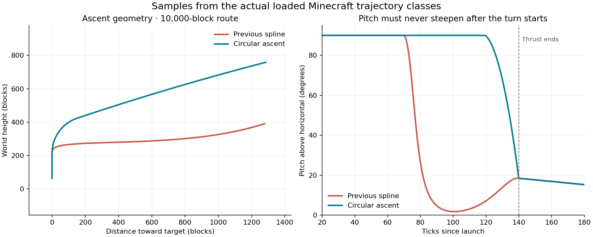

# Second review validation

Build: `build/libs/war_mod-1.0.0.jar`

SHA-256: `4382982EB159508DE332E98A4D0EBAAC6FA5941CFD1BA67B0ACC1552AF3EDCC9`

Final full build: 250 tests, 77 suites, zero failures/errors. Log: `build/fire-lod-validation/review2-pale-smoke-build.log`. Changes are uncommitted. Current development client was restarted from this source; no Gradle compilation was performed while that client was running.

## Ascent correction

The first revision checked forward displacement and a single ballistic apex but failed to constrain powered-ascent curvature. The unconstrained quintic flattened and then steepened, producing the reported S shape. Its replacement rises vertically to the requested height, follows one circular bend and joins the gravity coast with continuous position and velocity. Tangential acceleration controls speed without changing the curve's shape.

Read-only sampling used the classes actually loaded in Minecraft, with identical canonical 1,000-, 10,000- and 50,000-block routes. Old/new CSVs contain 3,123 samples each. Upward pitch reversals after horizontal motion began: **89 before, zero after**. Unit coverage additionally checks pitch, speed and direction at quarter-tick intervals across 18 distance/launch-height combinations.

Raw evidence: `build/fire-lod-validation/review2-trajectory-old.{txt,csv}` and `review2-trajectory-new.{txt,csv}`.

## Fire crash and continuity

Crash `run/crash-reports/crash-2026-09-05_02.10.13-client.txt` was an uncaught `Wind time reversed` in client fire wind history. Server time synchronization can rewind client world time, which also disturbed particle ages and fades. Visual time now advances once per client tick, independently of world-clock corrections. Existing particle birth origins remain stable; newly received timestamps are mapped into the visual clock. Repeated/out-of-order wind samples are ignored safely.

Live test deliberately changed client time by -250 ticks, then restored it. Raw times were 346089 → 345839 → 345847 → 346089 → 346103; visual ticks were 346502 → 346502 → 346510 → 346510 → 346517. More than 9,000 visual cells remained present and wind displacement stayed finite. No crash occurred. Evidence: `build/fire-lod-validation/review2-clock-rollback.txt`.

Recorded field visibility: 825 accepted packets, zero rejected/stale packets, 2,966 flame cards and 2,486 smoke cards in one view. This validates visibility in that view, not every LOD boundary or a universal performance improvement.

## Cluster radar

Live weak-HE cluster root `ba43ef85-9e1c-4e87-982f-1daf52e36f2a` became four independent terminal tracks at tick 364447. Each track used its warhead's UUID and contained exactly one of indices 0–3. Their shared entity root remained the carrier ID for yield, ownership and preparation bookkeeping.

The children entered impact independently at ticks 364994, 364998, 365022 and 365027; siblings remained in flight until their own impacts. A simultaneous regular missile retained its original carrier/root track with one terminal plan. Evidence: `build/fire-lod-validation/review2-cluster-radar-live.txt`. The helper's initial registry-correlation warning is a documented one-tick observation delay; the four track IDs and one-plan-per-track shapes were already correct.

## Nuclear throughput

One heavy nuclear live run began commits at impact tick 343328, changed 957,901 blocks across 1,676 chunks, and completed block/lighting work at tick 343834: 506 ticks, approximately 25.3 seconds at 20 TPS. Prepared coverage at impact was 70.43%, with no detonation gate wait. Terminal lease status ended CLEAN.

This exposed one further wasteful path: the spent carrier was refreshing its old root preparation after transferring it to terminal warheads. The final build stops that refresh on separation; a regression test covers the ownership transfer. The final guard has not had a second full heavy-nuclear timing run. The evidence establishes immediate initial mutation and completed drainage, not instantaneous completion of the entire footprint.

Diagnostic report: `run/saves/New World (3)/war_mod_diagnostics/performance-2026-09-05_01-25-55.txt`.

## Other checks and acceptance limits

- Workbench displayed joined body/head components and retained input stacks until extraction. A hopper extracted exactly two results and consumed exactly two recipes.
- Both owned anti-air turrets fired at an unowned silo launch. Their test ammunition was restored and the silo's existing missile stock was restored.
- Exposed silo doors rendered their metal texture instead of solid black after the lighting fix; chip/wrench front orientation was inspected.
- Material audit covered 184 runtime models, 166 referenced textures and 138 material tiles, with no missing textures, low-detail placeholders or suspicious UV references. The empty turret clearance model also received a valid block-breaking particle texture reference.
- Fire lineage expiry, regular dirt conversion, path nonflammability, saved deadlines, conventional outward-only impulses and nuclear return impulses have regression coverage.
- Subjective near-fire appearance, smoke visibility, audio, turret heat/shake intensity, extended-distance boundaries and long-duration grass regrowth remain user gameplay acceptance items. The checklist records them explicitly.

No temporary workbench/hopper test structure remains. The user's active position, inventory and ongoing review were preserved across the final restart. The diagnostic HUD enabled for measurement was disabled afterward.

## Launch controller and linking tool follow-up

The controller supports UUID-bound links to 64 silos, independent per-silo failure handling, a saved-target salvo on a redstone rising edge, and a common aimed target through a linked remote. Live two-silo checks confirmed one launch each under sustained power, followed by a second group launch through the remote. The controller screen was captured with both entries/statuses visible.

The new tool reuses the radar linking model. Live calls through the actual block interaction handlers selected the controller once, added silo A, added silo B, and added A again. Link counts were 0, 1, 2, 2 with the same controller component retained. Temporary structures were removed and all 19 original air blocks restored. Evidence: `build/fire-lod-validation/controller-linking-tool-live.txt`, `controller-cleanup.txt`; earlier redstone/remote reports: `controller-held-power.txt`, `controller-remote.txt`, `controller-after-remote.txt`.

## Launch smoke and slower silo lift

The large-card launch cloud was replaced with individually seeded small puffs using the same smoke sprite as explosions. They are submitted through Minecraft's native translucent particle pass after water, including its Fabulous particle target, with a low alpha cutoff for smooth fades. Ground clouds use loaded terrain/render-distance gating and a pause-safe monotonic visual clock.

Following live feedback, the final cloud uses white/light-grey tint, 960 bounded ICBM puffs (96 interceptor puffs), and stronger opacity. Most births occur in the first two seconds, with trailing emission through roughly five seconds. The opening feeds a rising core and wider outer billows; individual puff radii remain capped at 2.4 blocks. Four active clouds and stable distance-fading subsets bound the cost. No general FPS improvement is claimed.

Silo ICBMs now use a 60-tick, eight-block accelerating lift from their recessed launch position. Position and velocity are continuous at the handoff into the existing vertical/circular ascent. Doors remain open for 70 ticks. Test-stick launch timing and the ballistic arc geometry are preserved. A regression test checks midpoint/end displacement, acceleration, door clearance, continuity, and no renewed upward bend.

Final slow-lift live check: weak-HE launch accepted, 33 frames captured over 16 seconds, dense rising cloud visible, and original 11 cluster missiles restored through the container API. Evidence: `build/fire-lod-validation/review2-slow-lift-sweep/`, `review2-smoke-launch.txt`, `review2-smoke-restore.txt`. That capture exposed residual darkening from the shared explosion sprite, so the final shader remaps its RGB into pale exhaust while preserving silhouette and internal variation. Exact shoreline/water overlap and final subjective smoke appearance still require acceptance; the corrected particle pass is established from renderer routing, not a claim that every water/shader combination was visually tested.
